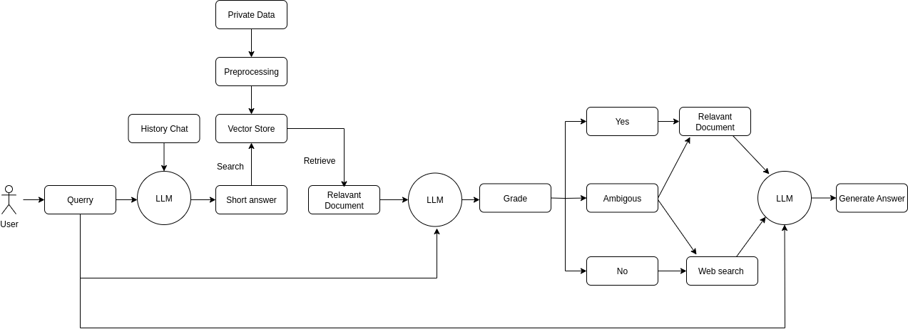
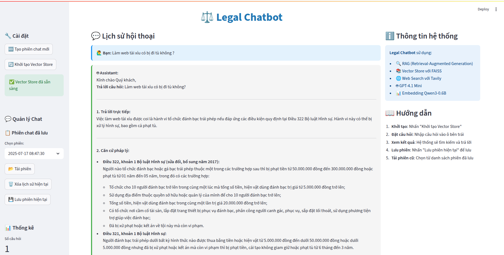

# Legal_RAG

Legal_RAG là chatbot hỗ trợ hỏi đáp pháp luật, sử dụng công nghệ RAG (Retrieval-Augmented Generation).

## Tính năng
- 🤖 Sinh câu trả lời tự động bằng GPT-4.1 Mini.
- 📚 Lưu và tải lại lịch sử phiên chat.
- 📊 Sử dụng FAISS Vector Store và embedding Qwen3-0.6B.
- 🌐 Tích hợp tìm kiếm web với Tavily.

## Cài đặt

1. **Clone dự án:**
    ```sh
    git clone https://github.com/yourusername/Legal_RAG.git
    ```

2. **Cài đặt thư viện:**
    ```sh
    pip install -r requirements.txt
    ```

3. **Chuẩn bị dữ liệu:**
    - Đặt các file văn bản luật vào thư mục `data/`.

4. **Thêm API Key:**
      ```
      OPENAI_API_KEY= your_openai_api_key
      TAVILY_API_KEY= your_tavily_api_key
      ```

5. **Tạo vector store:**
    ```sh
    python embedding.py
    ```

6. **Chạy ứng dụng:**
    ```sh
    streamlit run main.py
    ```
## Pipeline

## Giao diện

